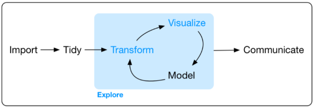

```{r setup, include=FALSE}
knitr::opts_chunk$set(warning = FALSE, message = FALSE)
library(tidyverse); library(plotly); library(quanteda)
```

# Load packages and trilogy data sets

In this introduction, we'll be walking through the various steps of a data science workflow using the `trilogy` datasets and related tools. Here's a visual of the steps of the data science process:

[{width="457"}](https://r4ds.had.co.nz/explore-intro.html#explore-intro)

In this model of the data science process, you start with data import and tidying. Then, you explore your data with an iterative cycle of transforming, visualizing, and modeling. Finally, you communicate your results with others.

Let's start by importing the tools and data we'll need:

-   the R packages we'll use
-   the `trilogy` datasets

The main package we'll use is the [tidyverse](https://www.tidyverse.org/), which is actually a collection of R packages with consistent design philosophy, grammar, and data structures.

To pull the current versions of the datasets, we'll follow the steps outlined in the [Getting Started \> Use in Reproducible Research](https://github.com/j-hagedorn/trilogy/blob/master/docs/vignettes/getting_started.md#use-in-reproducible-research) vignette. That's why you'll see a long, alphanumeric code in the links below, specifying precisely what version of the data is being used.

```{r load}
tmi <- read_csv("https://raw.githubusercontent.com/j-hagedorn/trilogy/d57c2cefd0b216c8ce5c251f618c3e931c732d0a/data/tmi.csv")
atu_df <- read_csv("https://raw.githubusercontent.com/j-hagedorn/trilogy/d57c2cefd0b216c8ce5c251f618c3e931c732d0a/data/atu_df.csv")
atu_seq <- read_csv("https://raw.githubusercontent.com/j-hagedorn/trilogy/d57c2cefd0b216c8ce5c251f618c3e931c732d0a/data/atu_seq.csv")
aft <- read_csv("https://raw.githubusercontent.com/j-hagedorn/trilogy/d57c2cefd0b216c8ce5c251f618c3e931c732d0a/data/aft.csv")
```

This allows us to explicitly reference a version of the data so that any research we do can be precisely replicated by others. For instance, if you wanted to pull an old (and not yet cleaned-up) version of the `aft` dataset, you'd just need to go back in the GitHub history and run the following:

```{r old_aft, eval=FALSE, include=TRUE}
old_aft <- read_csv("https://raw.githubusercontent.com/j-hagedorn/trilogy/f0fb12d108734847114f17980b05686a26305e38/data/aat.csv")
```

# Overview {.tabset .tabset-pills}

## Summary Stats

The table below shows the distinct count of motifs and tale types in *Trilogy* datasets.

```{r overlaps}

x <- 
  atu_seq %>% 
  # Get all tale IDs and motif IDs within them
  select(motif,atu_id) %>% 
  mutate(in_atu_seq = T) %>%
  # Pull in all tale IDs present in annotated tales.
  # Note that counting motifs in annotated tales assumes 
  # that each tale has each motif in the canonical sequence.
  left_join(
    aft %>% select(atu_id) %>% mutate(in_aft = T),
    by = "atu_id"
  ) %>%
  distinct(motif, in_atu_seq, in_aft) %>%
  mutate(in_aft = if_else(is.na(in_aft),F,T)) %>%
  # Don't keep multiple rows per motif, count as present (i.e. 'TRUE')
  group_by(motif, in_atu_seq) %>%
  filter(in_aft == max(in_aft))

m <-
  tmi %>%
  select(motif = id) %>%
  distinct(motif) %>%
  mutate(in_tmi = T) %>%
  full_join(x, by = "motif") %>%
  mutate(
    in_tmi =     if_else(is.na(in_tmi),F,in_tmi),
    in_atu_seq = if_else(is.na(in_atu_seq),F,in_atu_seq),
    in_aft =     if_else(is.na(in_aft),F,in_aft)
  ) 

m_sum <-
  m %>%
  summarise(
    in_tmi =     sum(in_tmi),
    in_atu_seq = sum(in_atu_seq),
    in_aft =     sum(in_aft)
  ) %>%
  mutate(unit = "motifs")
  
t <-
  atu_df %>%
  distinct(atu_id) %>%
  mutate(in_atu_df = T) %>%
  left_join(
    atu_seq %>% 
      distinct(atu_id) %>%
      mutate(in_atu_seq = T),
    by = "atu_id"
  ) %>%
  left_join(
    aft %>%
      distinct(atu_id) %>%
      mutate(in_aft = T),
    by = "atu_id"
  ) %>%
  mutate(
    in_atu_seq = if_else(is.na(in_atu_seq),F,in_atu_seq),
    in_aft = if_else(is.na(in_aft),F,in_aft)
  ) 

t_sum <-
  t %>%
  summarise(
    in_atu_df =  sum(in_atu_df),
    in_atu_seq = sum(in_atu_seq),
    in_aft =     sum(in_aft)
  ) %>%
  mutate(unit = "tale types")
  
m_sum %>%
  bind_rows(t_sum) %>%
  select(
    unit, tmi = in_tmi, 
    atu_df = in_atu_df, atu_seq = in_atu_seq, aft = in_aft
  ) %>%
  rmarkdown::paged_table()

rm(m); rm(m_sum); rm(t); rm(t_sum)

```

Note that motifs do not exist in `atu_df` or `atu_combos`, because those datasets contain one row per `atu_id`. Similarly, tale types (`atu_id`s) do not exist in `tmi`, because that dataset contains one row per motif.

The *Trilogy*'s datasets are linked by two key identifiers: motifs (i.e. `motif_id`) and tale types (i.e. `atu_id`). Understanding how these datasets overlap, and the proportion of available motifs and tale types which make them up, is necessary to using them successfully.

## Motif Intersections

Below is an [upset plot](https://doi.org/10.1109/TVCG.2014.2346248) showing the intersection of discrete motifs across the various datasets which comprise the *Trilogy*. Adding the value of the bars above each cell containing a dot should add up to the count of motifs shown in the *Summary Stats* tab. For instance, the `aft` contains 830 motifs (826 + 4).

```{r upset_motif}
library(UpSetR)

motif_lists <- 
  list(
    tmi = tmi %>% distinct(id) %>% .$id, 
    atu_seq = atu_seq %>% distinct(motif) %>% .$motif, 
    aft = x %>% filter(in_aft) %>% .$motif
  )

upset(
  fromList(motif_lists), 
  order.by = "freq",
  mainbar.y.label = "Intersection Size", 
  sets.x.label = "Motifs per Dataset"
)

rm(x); rm(motif_lists)

unjoined_motifs <-
  atu_seq %>% 
  select(motif) %>%
  distinct() %>%
  anti_join(tmi, by = c("motif" = "id"))
```

Observations:

-   The majority of motifs from the `tmi` are not present in the ATU (i.e. `atu_seq`). Specifically, 42,457 of the `r n_distinct(tmi$id)` motifs in the `tmi` (`r round(42457/n_distinct(tmi$id) * 100, digits = 1)`%) are **not** present in the ATU. This means that the tale types from the ATU make use of only `r 100 - round(42457/n_distinct(tmi$id) * 100, digits = 1)`% of the available motifs from the TMI.
-   Of the motifs which are present in the ATU (`atu_seq`), most (n = `r 2939 + 30`/`r n_distinct(atu_seq$motif)`) do **not** have corresponding annotated texts in the `aft`.
-   There are 826 motifs present among the tale types represented in the `aft` corpus. This is a minuscule `r round(826/n_distinct(tmi$id) * 100, digits = 1)`% of the total available motifs in the `tmi`. Fortunately, it can be increased with time and dedication.
-   There are a small number of odd instances (n = 34, *or 30 + 4*), where a motif ID is present in `atu_seq`, but not in the `tmi`. In 4 of these instances, there is one or more corresponding tale text in the `aft` which contains a non-`tmi` motif.[^1]

[^1]: The unmatched motif IDs include: `r paste(unjoined_motifs$motif, collapse = ", ")`. One can inspect these individually and compare them to the `tmi` and find that there are similar motifs that don't quite match. For instance, there is no "F661.1.1", but there is a "F661.11", or "Skillful Archer Uses Arrow As Boomerang".

`r bsicons::bs_icon("bell-fill")` **Exercise:** [Motif Coverage](#n_motifs)

------------------------------------------------------------------------

## Tale Type Intersections

Below is an [upset plot](https://doi.org/10.1109/TVCG.2014.2346248) showing the intersection of discrete tale types across the various datasets which comprise the *Trilogy*. A quick clarification may be helpful: `atu_df` contains all tale types, while `atu_seq` contains only tale types with motifs identified. Additional documentation regarding each of these can be found in the [data dictionary](https://github.com/j-hagedorn/trilogy/blob/master/docs/data_dictionary.md#atu).

```{r upset_types}
type_lists <- 
  list(
    atu_df = atu_df %>% distinct(atu_id) %>% .$atu_id, 
    atu_seq = atu_seq %>% distinct(atu_id) %>% .$atu_id, 
    aft = aft %>% distinct(atu_id) %>% .$atu_id
  )
upset(
  fromList(type_lists), 
  order.by = "freq",
  mainbar.y.label = "Intersection Size", 
  sets.x.label = "Tale Types per Dataset"
)
rm(unjoined_motifs); rm(type_lists)
```

Observations:

-   Not all `atu_id`s in `atu_df` are in `atu_seq`, because some of the tale summaries from `atu_df` do not reference any motif IDs.[^2]. Specifically, 597 tale types in the ATU do not have distinct motif IDs identified.
-   This means that an `atu_id` can be present in `atu_df` and in `aft`, but not be included in `atu_seq`, which means the text version of the tale cannot be referenced against an available list of motifs. Fortunately, this only applies to 8 tale types.
-   There are 174 tale types which occur across all three datasets: `atu_df`, `atu_seq`, and `aft`.
-   Most of the tale types from the ATU (`atu_df` and `atu_seq`) are not present in the `aft`. This underscores the need for more annotated texts.

[^2]: Motifs are extracted from the tale summaries present in the ATU [using the code here](https://github.com/j-hagedorn/trilogy/blob/d57c2cefd0b216c8ce5c251f618c3e931c732d0a/fetch/fetch_taletypes.R#L100-L127). An example of a tale summary without identified motif IDs is ATU 1342: "*During a cold winter, a satyr (wood spirit) meets a man (boy) who is cold and accommodates him in his cave. The satyr watches the man blowing in his hand and is told that in this way he wants to warm his numb fingers. When the satyr serves up a meal, his guest blows on the food and explains that he wants to cool it. The satyr is afraid of this strange human behavior, blowing hot and cold in the same manner, and chases the man away.*"

------------------------------------------------------------------------

# Motifs {.tabset .tabset-pills}

The `tmi` is comprised of `r n_distinct(tmi$id)` distinct motifs.[^3] It is grouped into `r n_distinct(tmi$chapter_id)` 'chapters', including: *`r paste(unique(tmi$chapter_name), collapse = ", ")`*. Beneath the chapter level are nested levels of groups, named as follows:

[^3]: Recall that Yarlott and Finlayson (2016) counted "46,248 motifs and sub-motifs, 41,796 of which have references to tales or tale types." While there is a difference in the total count of motifs, it is minimal, and it is unclear what they mean by sub-motifs.

-   `level_0` = What Thompson labelled 'Grand divisions', sections divisible by 100.
-   `level_1` = Smaller divisions end with '0', These are defined at intervals of 10.
-   `level_2`-`level_6` = Various sections with multiple layers of subdivisions

## Distribution by level

The most populated level of the index (i.e. '3') is that of the initial *subdivision*, indicating that there are frequently no splits made in the motif identified. While the index structure would allow for each subsequent level (i.e. levels 4 - 6+) to have increasing numbers of more finely grained motifs, these either do not exist or have not been filled in.

```{r}
tmi %>%
  ggplot(aes(x = level)) +
  geom_histogram(stat="count") +
  theme_minimal() + 
  theme(plot.title.position = "plot") +
  labs(
    title = "Most motifs are in the subdivisions",
    subtitle = "From chapters (level 0) through subdivisions (levels 3-6)",
    x = "Depth within index",
    y = "Distinct motif entries"
  )
```

------------------------------------------------------------------------

## Flat format

The excerpt below shows how this hierarchy structure is represented in the 'flat' dataset:

```{r, layout="l-body-outset"}
tmi %>%
  filter(level_2 == "B122") %>%
  select(chapter_id,id,motif_name,level,starts_with("level_")) %>%
  select(-level_5,-level_6) %>%
  arrange(id) %>%
  rmarkdown::paged_table()
```

Note that some motifs are not fit into the hierarchical level format (i.e. `level = NA`). This occurs when there is a zero indicator at one of the decimal indices, since this creates a break in the hierarchical structure. For instance, in the "B122" section, we find B122.1 as a parent motif for B122.1.1-2, but there is no B122.0 to serve as a parent for B122.0.1.

------------------------------------------------------------------------

## Summary

`r bsicons::bs_icon("bell-fill")` **Exercise:** [Summarizing and Filtering](#agg_filt)

The table below shows how many motifs (i.e. `n_motifs`) are in each chapter, and each level (*if you expand the row*).

```{r tmi_summary_tbl}
library(reactable)
tmi %>%
  group_by(chapter_name,level) %>%
  summarize(n_motifs = n_distinct(id)) %>%
  reactable(
    groupBy = c("chapter_name"),
    columns = list(
      level = colDef(
        aggregate = "count",
        format = list(
          aggregated = colFormat(suffix = " levels")
        )
      ),
      n_motifs = colDef(aggregate = "sum")
    )
  )
```

```{r}
summary_df <-
  tmi %>%
  group_by(chapter_id,chapter_name,level_0,level_1,level_2,level_3) %>%
  summarize(n = n()) %>% 
  ungroup() %>%
  left_join(tmi %>% select(id,level_0_name = motif_name), by = c("level_0" = "id")) %>%
  left_join(tmi %>% select(id,level_1_name = motif_name), by = c("level_1" = "id")) %>%
  left_join(tmi %>% select(id,level_2_name = motif_name), by = c("level_2" = "id")) %>%
  left_join(tmi %>% select(id,level_3_name = motif_name), by = c("level_3" = "id")) %>%
  select(
    starts_with("chapter_"),starts_with("level_0"),
    starts_with("level_1"),starts_with("level_2"),starts_with("level_3"),n
  )
```

------------------------------------------------------------------------

# Tale Types {.tabset .tabset-pills}

Tale types are derived from the Aarne–Thompson–Uther Index (ATU). It is represented in the *Trilogy* by three distinct datasets: `atu_df`, `atu_seq`, and `atu_combos`. Additional documentation regarding each of these can be found in the [data dictionary](https://github.com/j-hagedorn/trilogy/blob/master/docs/data_dictionary.md#atu).

## Types and Descriptions

The `atu_df` is comprised of `r n_distinct(atu_df$atu_id)` distinct tale types, each with a formal identifier (`atu_id`). It is grouped into `r n_distinct(atu_df$chapter)` chapters, which are broken into sub-sections, or divisions. There are `r n_distinct(atu_df$division)` divisions in the index. You can click on the treemap below to explore each chapter and its divisions and subdivisions:

```{r atu_treemap}
stack <-
  atu_df %>%
  group_by(chapter) %>%
  summarize(n = n()) %>% ungroup() %>%
  mutate(parent = "") %>% rename(child = chapter) %>% select(parent,child,n) %>%
  bind_rows(
    atu_df %>% select(parent = chapter, child = division) %>%
      group_by(parent,child) %>% summarize(n = n()) %>% ungroup()
  ) %>%
  bind_rows(
    atu_df %>% select(parent = division, child = sub_division) %>%
      group_by(parent,child) %>% summarize(n = n()) %>% ungroup()
  ) %>%
  ungroup() %>%
  filter(!is.na(child)) %>%
  mutate(id = str_c("r_",row_number()))

plotly::plot_ly(
  type = "treemap", # "sunburst"
  branchvalues = "total",
  labels = stack$child,
  values = stack$n,
  parents = stack$parent
)

rm(stack)
```

------------------------------------------------------------------------

## Motif Sequences {#motif_seqs}

```{r summary_atu_seq}
summary_atu_seq <- 
  atu_seq %>%
  left_join(
    aft %>% distinct(atu_id) %>% mutate(in_aft = T)
  ) %>%
  mutate(in_aft = if_else(is.na(in_aft),F,in_aft)) %>%
  group_by(atu_id,in_aft) %>%
  summarize(
    variants = max(tale_variant),
    n_motifs = n_distinct(motif)
  ) %>%
  ungroup() 
```

The `atu_seq` dataset has one row for each occurrence of a TMI motif within a tale type from the ATU index. It was produced by pulling motif IDs from the `tale_type` description from the `atu_df` dataset. There are an average of `r round(mean(summary_atu_seq$variants), digits = 1)` tale variants[^4] and `r round(mean(summary_atu_seq$n_motifs), digits = 1)` motifs per tale type, with the distributions shown below:

[^4]: With some extreme outliers, that is.

```{r atu_hist}
library(patchwork)

p1 <-
  summary_atu_seq %>%
  slice_min(order_by = variants, prop = 0.99) %>%
  ggplot(aes(x = variants)) +
  geom_histogram(stat="count") +
  theme_minimal() 

p2 <-
  summary_atu_seq %>%
  ggplot(aes(x = n_motifs)) +
  geom_histogram(stat="count") +
  theme_minimal() 

p <- p1 / p2

p + plot_annotation(
  title = 'How many stories? How many parts?',
  subtitle = 'Distribution of variant and motif counts within the ATU',
  caption = 'NB: Outliers removed from variants'
)

rm(p); rm(p1); rm(p2)
```

The table below shows the average number of tale variants and the average number of motifs per tale type, in both the `atu_seq` and `aft`.

```{r}
summary_atu_seq %>%
  summarize(
    total_variants = sum(variants, na.rm = T),
    avg_variants = round(mean(variants, na.rm = T), digits = 1),
    med_variants = round(median(variants, na.rm = T), digits = 1),
    avg_motifs = round(mean(n_motifs, na.rm = T), digits = 1)
  ) %>%
  mutate(dataset = "atu_seq") %>%
  select(dataset,total_variants,avg_variants,med_variants,avg_motifs) %>%
  bind_rows(
    summary_atu_seq %>%
      filter(in_aft == T) %>%
      summarize(
        total_variants = sum(variants, na.rm = T),
        avg_variants = round(mean(variants, na.rm = T), digits = 1),
        med_variants = round(median(variants, na.rm = T), digits = 1),
        avg_motifs = round(mean(n_motifs, na.rm = T), digits = 1)
      ) %>%
      mutate(dataset = "aft") %>%
      select(dataset,total_variants,avg_variants,med_variants,avg_motifs)
  ) %>%
  rmarkdown::paged_table()
```

------------------------------------------------------------------------

## Tale Variants

For some tales, multiple combinations of motifs are noted as possible permutations of the tale (for example, ATU 605A is a story in which "*A young man, born of an animal... or from a giant... [B631, F611.1.1, F611.1.11-F611.1.15, T516] develops great strength (at the forge, in the forest, in war, by suckling for many years [F611.2.1, F611.2.3]...)*"). In these instances, all of the possible permutations are listed as specific variants of the tale type. When ranges of motifs are referenced (e.g. *F611.1.11-F611.1.15*, above) all motifs within that range are included and provided with different variants.[^5]

[^5]: Note that when the suffix "ff." (i.e. *and following*) is appended to a motif, we do not include all motifs following it, since it is unclear precisely what is intended by this convention.

The table below shows the tale types with the top 1% of variants derived from the method described above:

```{r}
summary_atu_seq %>%
  slice_max(order_by = variants, prop = 0.01) %>%
  rmarkdown::paged_table()
```

Here, we see that `r format(46332 + 15552, scientific = F)` (i.e. 46332 + 15552) tale variants out of the total `r format(sum(summary_atu_seq$variants), scientific = F)` (`r round((46332 + 15552)/sum(summary_atu_seq$variants) * 100, digits = 1)`%) are due to 2 extreme outliers caused by a combinatorial explosion. Without these included, there would be `r sum(summary_atu_seq$variants) - (46332 + 15552)` tale variants, derived from a total of `r n_distinct(summary_atu_seq$atu_id)` tale types in the `atu_seq` dataset.

`r bsicons::bs_icon("bell-fill")` **Exercise:** [Remove Outliers](#filter_atu_seq)

------------------------------------------------------------------------

# Annotated Folktales {.tabset .tabset-pills}

Our [article in the Journal of Open Humanities Data](https://openhumanitiesdata.metajnl.com/articles/10.5334/johd.78) describes the Annotated Folktales portion of the Trilogy datasets.  You can find the [original code here](https://github.com/j-hagedorn/trilogy/blob/master/docs/analyses/aft_article_intro/aft_article_johd.Rmd), but we'll run through it below so you can understand how it relates to the data you are using.

```{r summary_aft}
summary_aft <-
  aft %>%
  mutate(
    n_words = str_count(aft$text, '\\w+'),
    n_sentences = quanteda::nsentence(text),
    n_tokens = quanteda::ntoken(text),
    n_types = quanteda::ntype(text),
    tokens_per_sentence = n_tokens/n_sentences
  ) %>%
  left_join(
    atu_df %>% select(atu_id,chapter,division,sub_division,tale_name), 
    by = ("atu_id")
  ) %>%
  select(
    atu_id,chapter,division,tale_name,tale_title,
    starts_with("n_"),tokens_per_sentence
  ) 

```

`r bsicons::bs_icon("bell-fill")` **Exercise:** [If You Can't Beat Them... Join Them](#try_joins)

## Summary Table

The table below reproduces [the one published in the JOHD article](https://openhumanitiesdata.metajnl.com/articles/10.5334/johd.78#T2).  Note that a few of the summary statistics vary slightly from what is reported there.  That's because we are using a newer release of the Trilogy data, and some of the data cleaning that has been done since publication affects the tokenization of text from the tales.

```{r summary_aft_tbl}

summary_aft %>%
  summarize(
    `Number of tales` = n(),
    `Number of tale types` = n_distinct(atu_id),
    `Mean tokens per tale` = round(mean(n_tokens), digits = 1),
    `Median tokens per tale` = round(median(n_tokens), digits = 1),
    `Minimum tokens per tale` = round(min(n_tokens), digits = 1),
    `Maximum tokens per tale` = round(max(n_tokens), digits = 1),
    `Mean sentences per tale` = round(mean(n_sentences), digits = 1),
    `Median sentences per tale` = round(median(n_sentences), digits = 1),
  ) %>%
  mutate_all(list(~as.character(.))) %>%
  tibble::rownames_to_column() %>%  
  pivot_longer(-rowname) %>% 
  pivot_wider(names_from=rowname, values_from=value) %>%
  rename(Measure = name, Value = `1`) %>%
  rmarkdown::paged_table()

```

------------------------------------------------------------------------

## Histogram

We can also reproduce [the histogram from the article](https://openhumanitiesdata.metajnl.com/articles/10.5334/johd.78#F1):

```{r aft_tokens_hist}

summary_aft %>%
  ggplot(aes(x = n_tokens)) +
  geom_histogram(binwidth = 250) +
  labs(
    caption = "Each bar represents a range of 250 (e.g. 0-250 tokens, 251-500, etc.)",
    x = "Number of tokens in tale",
    y = "Number of tales"
  ) + 
  xlim(c(-200, 6000)) +
  theme_minimal() + 
  theme(
    plot.title.position = "plot",
    text = element_text(family = "Mono",size = 13),
    panel.grid.major.x = element_blank(),
    panel.grid.minor.x = element_blank(),
    panel.grid.major.y = element_line(size=.1, color="grey" ),
    panel.grid.minor.y = element_line(size=.1, color="grey" ),
    axis.text.x.bottom = element_text()
  )

```

Note that you can update the histogram above by supplying another value to the `x` variable in the call to the `ggplot()` function.

------------------------------------------------------------------------

## Top Tales

Below we can see the top 20 tale types represented in the `aft`, and the number of specific tale texts from each type.  This table reproduces [the one from the JOHD article](https://openhumanitiesdata.metajnl.com/articles/10.5334/johd.78#T3), and expands it to show the top 20 tale types represented and the average number of words per text:

```{r aft_type_tbl}
summary_aft %>%
  group_by(atu_id, tale_name) %>%
  summarize(
    n_tales = n(),
    avg_words = round(mean(n_words), digits = 1)
  ) %>%
  ungroup() %>%
  mutate(
    tale_name = str_remove_all(tale_name,"\\s*\\([^\\)]+\\)"),
    tale_name = str_remove(tale_name,"\\(.*")
  ) %>%
  top_n(20, n_tales)  %>%
  arrange(desc(n_tales)) %>%
  rmarkdown::paged_table()
```

------------------------------------------------------------------------

# Exercises

## How many motifs? {#n_motifs}

Calculate what percentage of motifs from the TMI are covered:

1.  in the ATU's tale types
2.  in the AFT corpus

```{r, echo=TRUE}

```

## Summarizing and filtering {#agg_filt}

Make a dataframe that groups the `tmi` by chapter, and contains the following variables:

-   the number of distinct motif IDs per chapter
-   the number of rows per chapter
-   the number of motifs including the word "Serpent"
-   the percentage of distinct motifs including the word "Serpent"

```{r, echo = TRUE}

```

## Just the normal variants, please {#filter_atu_seq}

Create a new data frame of ATU motif sequences that omits outliers.

```{r, echo = TRUE}

```

## If you can't beat them... join {#try_joins}

Now that we've seen the parts of the Trilogy, we can use all 3 parts to answer questions.  Here are a few: 

- How many texts from the `aft` contain the motif "Tabu: Revealing Knowledge Of Animal Languages"?
- How about "Knowledge Of Animal Languages"?

```{r, echo = TRUE}

x <-
  tmi %>%
  filter(str_detect(motif_name,"Tabu: Revealing Knowledge Of Animal Languages")) %>%
  select(id)

y <- 
  atu_seq %>%
  inner_join(x, by = c("motif" = "id")) %>%
  distinct(atu_id)
  
z <-
  aft %>%
  inner_join(y, by = "atu_id")

```

