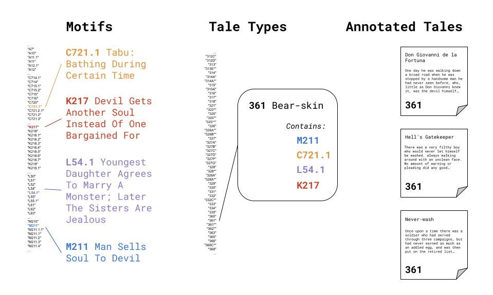

# Soon you'll know...

- __What it is.__  
  - List data assets which make up the `r bsicons::bs_icon("stack")` `trilogy`

- __How to use it.__ 
  - Use tales and taxonomies with data science tools
  - Create a pipeline for novel, reproducible research
  - Contribute fixes, extensions or annotated texts.

# What is it?

## `r bsicons::bs_icon("signpost-split-fill")` Purpose

- Tidy data of folklore taxonomies and annotated texts
- A common platform for reproducible research
- Less data cleaning, more analysis
- Open for use with a [CC BY-SA 4.0](https://creativecommons.org/licenses/by-sa/4.0/) license
- Available on [GitHub](https://github.com/j-hagedorn/trilogy)

## `r bsicons::bs_icon("border-style")` Contents

- `tmi`: the *Thompson Motif Index*
- `atu_df`: all tale types from the *Aarne-Thompson-Uther* Tale Type Index
- `atu_seq`: subset of ATU tale types with associated motifs
- `aft`: some *Annotated Folktales*, seeded with [D.L. Ashliman’s corpus](https://sites.pitt.edu/~dash/folktexts.html)

## How `r bsicons::bs_icon("stack")`'s parts relate

## Notes

- Annotations are at the tale level, not the phrase level.

# What isn't it?

## `r bsicons::bs_icon("exclamation-triangle-fill")` Some limitations

- These taxonomies were designed for `r bsicons::bs_icon("journal-text")`, not `r bsicons::bs_icon("file-code")`
- Motifs are not a periodic table of elements
- Lacks oral elements of tale-telling (*e.g. pauses, sighs*)

# How can you use it?

## `r bsicons::bs_icon("vector-pen")` Research

- Engage [reproducible research](https://doi.org/10.1146/annurev-publhealth-012420-105110) of folklore narratives
- [Let distant research teams collaborate](https://docs.github.com/en/get-started/start-your-journey/about-github-and-git)
- Parallels use of standard data and taxonomies in  [genomics](https://scholar.google.com/scholar?cites=5360173642221970934&as_sdt=80000005&sciodt=0,23&hl=en)

## `r bsicons::bs_icon("noise-reduction")` Cleaning

- Data quality improves as data is used
- [File issues](https://github.com/j-hagedorn/trilogy/issues/new) if you find errors or have suggestions
- *Even better*, submit corrections as pull requests `r bsicons::bs_icon("sign-merge-left-fill")`

## `r bsicons::bs_icon("tag-fill")` Annotating Tales

- Submit a corpus of [annotated tales](https://github.com/j-hagedorn/trilogy/blob/master/docs/vignettes/getting_started.md#growing-and-refining-the-corpus) as a pull request to grow the `r bsicons::bs_icon("stack")`
- If you add a new corpus (*e.g. The 1,001 Nights*), we'll make a unique DOI you can publish (*e.g. in [JOHD](https://openhumanitiesdata.metajnl.com/)*)

## `r bsicons::bs_icon("database-fill-add")` Extending

- Extend the base of knowledge *via* user contributions
